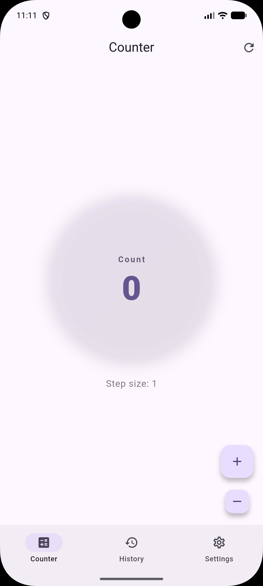
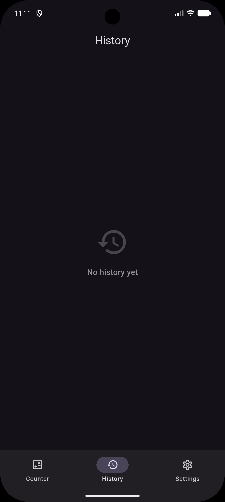
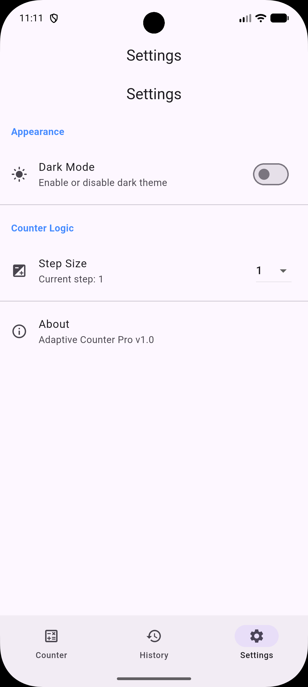
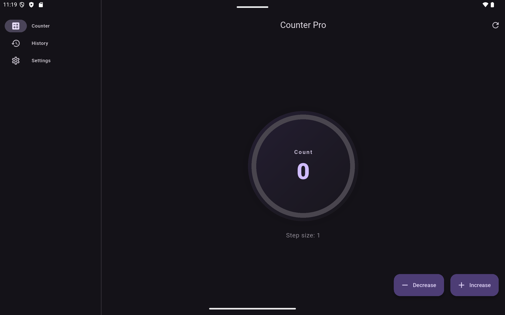
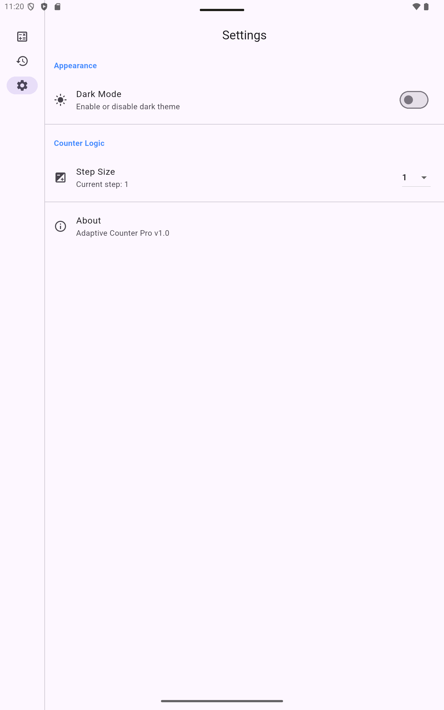
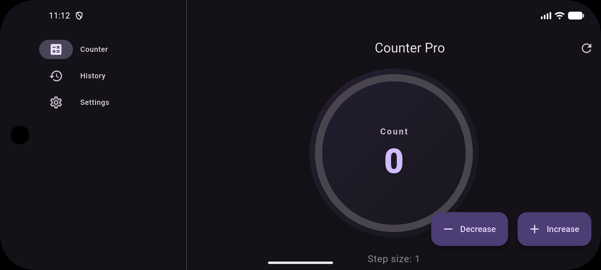
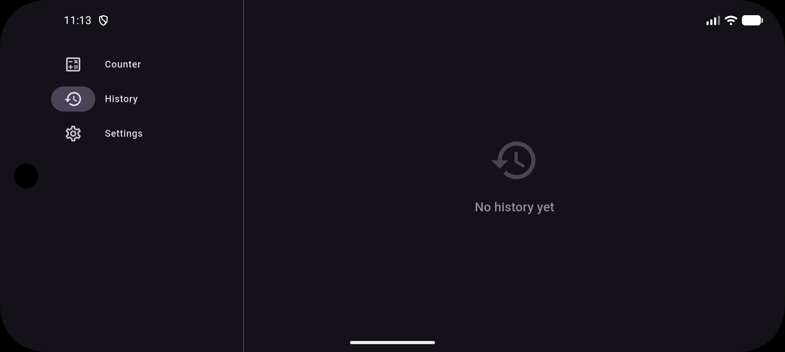

# Basic Counter: Adaptive & Professional

A professional, feature-rich counter application built with Flutter. This project demonstrates a **Feature-First Architecture**, **Adaptive UI** principles, and **Multi-Platform** excellence, providing a native experience across Mobile, Tablet, and Desktop.

## 🚀 Key Features

- **Adaptive & Responsive Layouts**:
  - **Mobile**: Intuitive Bottom Navigation and floating action buttons.
  - **Tablet/Desktop**: Side Navigation Rail and optimized wide-screen layouts (e.g., dual-column settings).
- **Professional Splash Flow**: 
  - Integrated **Native Splash** for instant boot.
  - Custom **Flutter Animation** for a smooth transition into the app logic.
- **Detailed History Tracking**: 
  - Real-time logging of every action.
  - Accurate timestamps and visual indicators (Increment vs. Decrement).
  - Reverse-chronological list for quick access to recent activity.
- **Advanced & Native Settings**:
  - **Adaptive Widgets**: Automatically switches between Material and Cupertino styles based on the platform.
  - **Configuration**: Customizable Step Sizes, Haptic Feedback (Vibration), and Sound Effects.
  - **Full Theme Support**: System-synced Dark Mode.
- **Developer Friendly**: 
  - Extensive code comments and documentation tailored for learning.
  - Clean **Feature-First Architecture** for high maintainability.

## 📸 Visual Showcase

### Mobile Experience
| Counter (Light) | History (Dark) | Settings (Light) |
| :---: | :---: | :---: |
|  |  |  |

### Tablet & Wide Screens
| Counter (Landscape Dark) | Settings (Portrait Light) |
| :---: | :---: |
|  |  |

### Adaptive Landscape (Mobile)
| Counter | History |
| :---: | :---: |
|  |  |

## 🏗️ Project Structure

The project follows a clean, folder-by-feature structure:

```text
lib/
├── app/                       # Global App Logic, Theme & Design System
├── features/                  # Independent Business Features
│   ├── counter/               # Main Counter logic & display
│   ├── history/               # Activity logging & models
│   ├── settings/              # Multi-column adaptive preferences
│   └── splash/                # Animated entry sequence
└── main.dart                  # Clean entry point
```

## 🛠️ Installation & Setup

1. **Clone the repository**
2. **Install dependencies**:
   ```bash
   flutter pub get
   ```
3. **Generate Native Splash Screens**:
   To ensure the splash screen looks native on boot (Android/iOS), run:
   ```bash
   dart run flutter_native_splash:create
   ```
4. **Run the application**:
   ```bash
   flutter run
   ```

## 📱 Platform Support

- **Android / iOS**: Mobile-optimized touch interface with adaptive haptics.
- **Windows / macOS / Linux**: Desktop-native Navigation Rail and multi-column layouts.
- **Web**: Fully responsive web implementation.

---
Built with ❤️ using Flutter, Material 3, and best-practice adaptive design.
